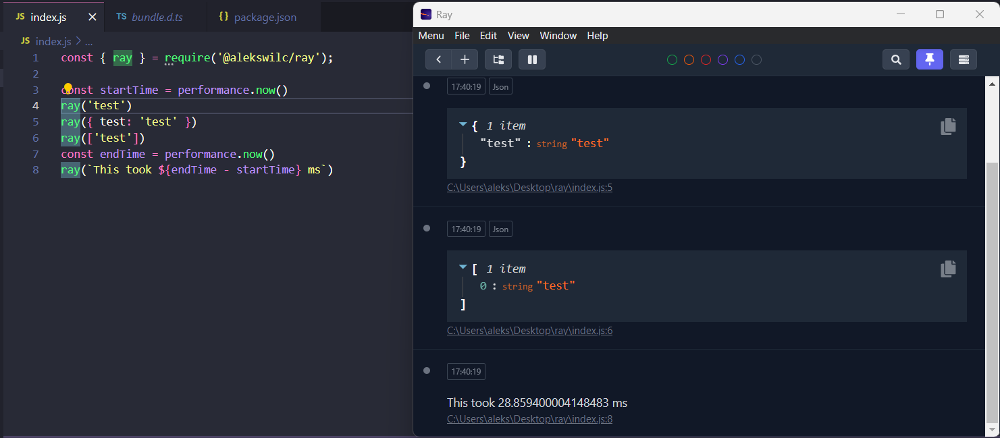

# @alekswilc/ray

Lightweight & fast [ray](https://myray.app/) integration library written in typescript

- Supports ESM and CommonJS
- Provides standalone bundle
- Supports node 16+
- Simple usage



## Install

```
npm config set @alekswilc:registry=https://git.alekswilc.dev/api/packages/alekswilc/npm/
npm i @alekswilc/ray
```


### Performance
- 3 requests took avg 28ms.
- avg 2Mb memory usage on request

### Env configuration
- `ALEKSRAY_URI` (default: http://localhost:23517/)
- `ALEKSRAY_DISABLED` (default: null)


### Methods
```ts
/* COLORS */
import { ray } from '@alekswilc/ray';
ray("Message").green();
ray("Message").orange();
ray("Message").red();
ray("Message").purple();
ray("Message").blue();
ray("Message").gray();
ray("Message").color('red');

/* LOGGER */
ray().log("Message")
ray().info("Message")
ray().debug("Message")
ray().warn("Message")
ray().error("Message")
ray().error(new Error("Message"))


/* FORMATS */
ray().label('TEST'); // set label
ray().separator(); // display separator
ray().raw({"test"}); // raw log
ray().json({"test"}); // display json
ray().pretty(["test"]) // display using pretty-format
ray().send("data") // alias to ray("data")
await ray().pause() // break point [ASYNC FUNCTION]


/* SET CUSTOM ORIGIN */
ray().customOrigin({ function_name: "test", file: "test.js", line_number: 1, hostname: "aleks-desktop" }).send("test")

/* CHAINING */
ray('test').color('red').label('test2') 

```

### Used dependencies
- [stacktrace-js](https://github.com/stacktracejs/stacktrace.js)
- [@permafrost-dev/pretty-format](https://github.com/permafrost-dev/pretty-format)
- [uuid](https://github.com/uuidjs/uuid)


## License
The MIT License (MIT). Please see [License File](/LICENSE) for more information.

## Credits
- [Permafrost Development](https://github.com/permafrost-dev) ([node-ray](https://github.com/permafrost-dev/node-ray) under The MIT License)
